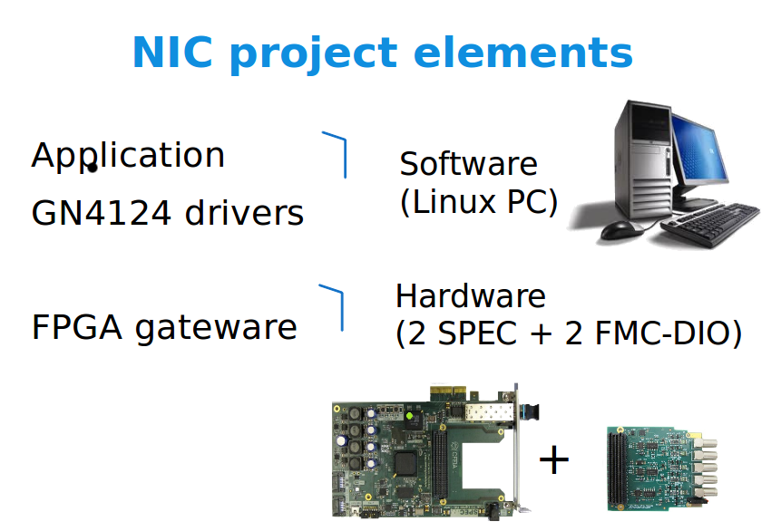
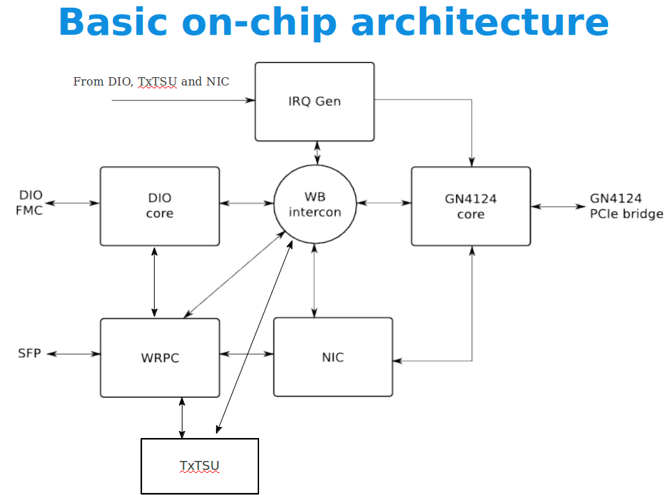
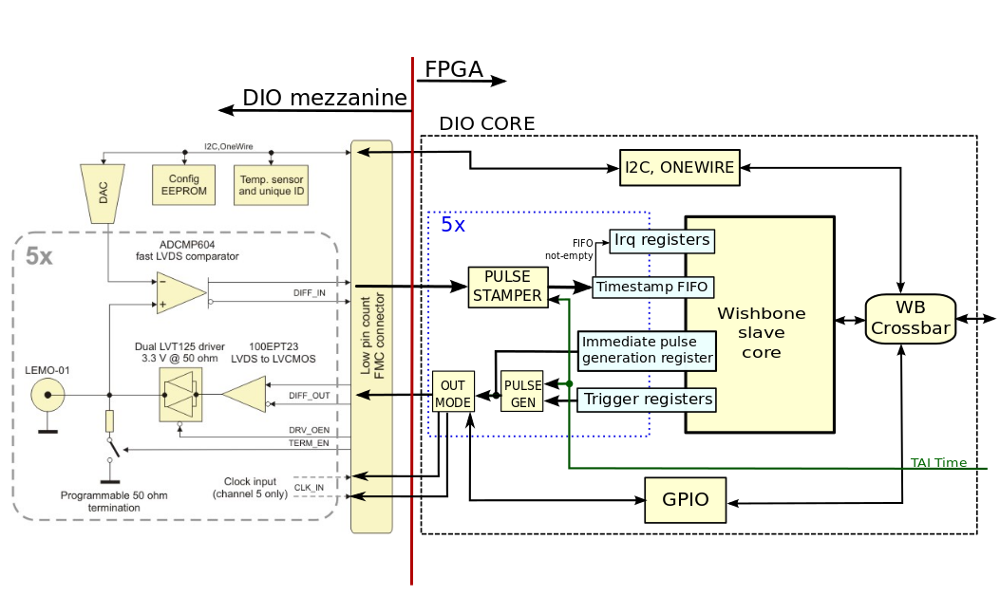
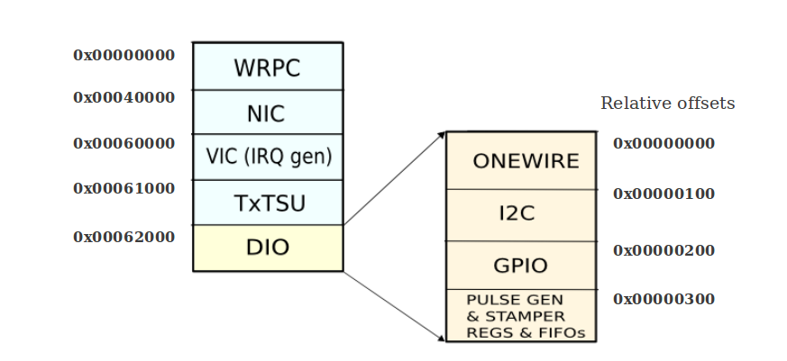

% White-Rabbit  NIC Gateware
% Javier Díaz Univ. of Granada, Rafael Rodriguez Seven Solutions
% 14 Dec. 2012

Introduction
=========================
The White-Rabbit Network Interface Card  (WR-NIC) project is concerned with the development of gateware and software to make the combination of a SPEC and a DIO mezzanine behave as a Network Interface Card (NIC) under Linux. Basic demo uses two SPEC boards, one configured as grandmaster and one as slave. Different  simple use cases will be provided as basic demo.  
This document focuses on the description of the project gateware. This manual is part of the associated hardware project, hosted at <http://www.ohwr.org/projects/wr-nic/repository>, whose git repository hosts the latest version.

Note that the WR-NIC project inherits many codes and working methodology of many other projects. Specially important to highly the following ones: 

1. White-Rabbit core collection: <http://www.ohwr.org/projects/wr-cores> (wishbonized branch). Look at the WR PTP Core. It is a black-box standalone WR-PTP protocol core, incorporating a CPU, WR MAC and PLLs. It is also convenient to look at TxTSU and NIC project. For further details, search for its related wbgen2 files (extension .wb). 
2. Software for White-Rabbit PTP core: <http://www.ohwr.org/projects/wrpc-sw> (a subproject of the previous one)
3. Gennum GN4124 core: <http://www.ohwr.org/projects/gn4124-core> 
4. The platform independent core collection: <http://www.ohwr.org/projects/general-cores>. An important one is the Wishbone crossbar with is downloaded at the `DOWNLOAD_PATH/wr-cores/ip_cores/general-cores/modules/wishbone`. 

In addition to these projects, software support is provided from the project: 
1. Software (driver, fmc-bus and NIC working examples) <http://www.ohwr.org/projects/spec-sw>. This project requires a "golden  FPGA gateware" (spec-init.bin) which is available at <http://www.ohwr.org/projects/spec-sw/files>
2. Starting kit tutorial. A quick overview about the global project (mainly tutorials and applications examples). It is available at 

Gateware elements
=====================
The main block modules of the architecture are described on next figure. 

Here is a quick description of each block:

* The `DIO core` allows configuration of each one of the 5 channels of the DIO mezzanine as input or output. For inputs, it provides an accurate time stamp (using time information from the WRPC, not shown in the diagram) and optionally a host (PCIe) interrupt via the IRQ Gen block. For outputs, it allows the user to schedule the generation of a pulse at a given future time, or to generate it immediately.
* The `IRQ Gen` block receives one-tick-long pulses from other blocks and generates interrupt requests to the GN4124 core. It also includes interrupt source and mask registers.
* The `WB intercon` block ensures seamless interconnection of Wishbone masters and slaves using a crossbar topology.
The `GN4124 core` is a bridge between the GN4124 PCIe interface chip and the internal Wishbone bus, allowing communication with the host and interrupts --> pipelined version!
* The `WRPC (White Rabbit PTP Core)` communicates with the outside world through the SFP socket in the SPEC, typically using fiber optics. It deals with the WR PTP using an internal LM32 CPU running a portable PTP stack. It forwards/receives non-PTP frames to/from the NIC block, using two pipelined Wishbone interfaces (master and slave for forwarding and receiving respectively). It also provides time information to other cores (not represented in the diagram), and time-tags for transmitted and received frames that can be read through Wishbone for diagnostics purposes. Future versions will include the PPSi library instead of the current PTP stack. 
* The `NIC core` ensures communication between the host and the WRPC. More precisely, it interrupts the host and provides a descriptor that the host can use to fetch incoming frames. For outgoing frames, it receives a descriptor from the host, fetches the frame using PCIe via the GN4124 core and sends it to the WRPC using a pipelined Wishbone interface.
* The `TxTSU module` collect timestamps with associated Ethernet frame identifiers and puts them in a shared FIFO (port identifier is also included although not required for the SPEC card because only one Ethernet port is available but it is included to provide a common descriptor with the switch data). A IRQ is triggered when FIFO is not empty so drivers could read TX timestamps and frame/port identifiers. 

In the next sections we provide a little more information about `DIO core` and the `WRPC (White Rabbit PTP Core)` in order to understand better how the whole system works.   
Finally, it is important to know that current HDL code contains commented code to activate on-chip logic analyzer circuitry for debugging based on Chipscope of Xilinx. Top file as well as different peripherals include the signals TRIG0 - TRIG3 to help on this purpose. Nevertheless, by default they are commented to avoid wasting unnecessary resources (in fact it could be required to reduce blockram utilization, for instance of NIC or wr_core module in order to use Chipscope on the project, otherwise design is overmapped). 

WRPC (White Rabbit PTP Core)
----------------------------
The `WRPC (White Rabbit PTP Core)` block is the HDL block that makes possible the White-Rabbit timing functionalities on the White-Rabbit nodes. It is a black-box standalone WR-PTP protocol core, incorporating a CPU LM32, WR MAC and PLLs. It could be configure to work on 3 different operations modes:  

* Grandmaster: WRPC locks to an external 10 MHz and PPS signal provided for instance from a Cesium clock / GPS. This signals are provided from the channel 4 (PPS) and channel 5 (10 MHz) lemo connectors of the DIO card.

* Master: the systems uses the VCO oscillators of the SPEC board basically on a free running modes. 

* Slaves: The clock information is recovered from the Ethernet connections and the local clock uses the DDMTD method to follow the external clock.  

In this project, WRPC provides the timing information used for accurate output generation and input time stamping of the DIO signals. Note that this data is provided with an accuracy of 8 ns. 

Please note that the current gateware contains the LM32 firmware (so the FPGA) . The embedded binary corresponds to the `wr-nic-v1.0` release available at: <http://www.ohwr.org/projects/wrpc-sw/repository>. 

It is important to remark that for this release the I2C bus of the FMC-DIO card is connected to WRPC. This is needed because current implementation of WRPC store configuration data on the FMC-DIO card EEPROM. Please be aware that for future releases this could change. 
 
The whole description of the core goes beyond the scope of this documentation but the additional information is available at: <http://www.ohwr.org/projects/wr-cores/wiki/Wrpc_core> and in: 

G. Daniluk, White Rabbit PTP Core the sub-nanosecond time synchronization over Ethernet, 2012.
M.Sc thesis describing the development and implementation of the first standalone HDL module handling the sub-nanosecond synchronization over a regular Ethernet - the White Rabbit PTP Core.
Available at: `http://www.ohwr.org/attachments/1368/GD_mgr.pdf` 

DIO core
----------
The `DIO Core` block is the HDL block that access to the fmc-dio-5chls mezzanine card. The core goes beyond a standard GPIO core to include advanced functionalities related with timing. Their main elements are shown on the next figure. 

The different submodules description are:  

* `GPIO:` It allows to enable/disable the output drivers and the termination resistors.

* `I2C:` It allows to set the threshold of the ADCMP604 fast LVDS comparator and to access to write/read data to the EEPROM memory (24AA64). Please note that already commented, current release do not allow to access I2C signals of the FMC-DIO card from this HDL block. This is assigned to WRPC and therefore it should be handled inside its memory maps (concretely, inside WRPC `Syscon` device). This could change for future releases.

* `Onewire:` It is used for temperature acquisition

* Modules to generate or stamping pulses:  

	1. `Pulse generator:` It produces a  programmable ticks-long pulse in its output when the time passed to it through a vector equals a pre-programmed time.
	2. `Pulse stamper:` It associates a time-tag with an asynchronous input pulse

* Additional Wishbone slave core generated elements are:  

	1. Trigger registers (time counters for pulse generation)
	2. FIFOs to store the timestamps of input signals
	3. Interrupt control registers that allow to configure the interrupts  generated when there are data in the FIFOs.
	4. Monostable register, which generates a single clock cycle-long

DIO Configuration & Control
==========================
Accessing to the different system elements is as simple as doing a read/write memory access. The memory map of the different elements of the board are: 

Any address within this memory space may be addressed by the PC to configure corresponding module (WRPTP, NIC, TxTSU, etc...). Many of them are already well known so we will skip their descriptions. In next paragraphs we supposed that the utilization of these elements are already known and we will just focus on the DIO core which is the new block added to the OHWR. 

DIO core utilization
--------------------

The DIO core, according to its architecture already shown, it allows to read input data of each of the 5 channel with precise time-tag information provided by the WRPTP core. It is also possible to program output at a precise time or we could just generate an output signals immediately. In addition, it is also possible to configure different boards elements as terminator resistors or reference voltage Level using the DAC. All these elements could be controlled independently for each of the 5 channels. More information about the different board configuration elements is available at: <http://www.ohwr.org/projects/fmc-dio-5chttla>
Note that dio channels time base work wth 8 ns accuracy for inputs time-tagging. Outputs need to be generated align on 8 ns time-slices but their time-stamps values have subnanosecond accuracy thanks to the White-Rabbit timing properties. 

In order to use input/output channels as previously described, the following actions are required:  

* Standard GPIO output generation is selected by default. In order to use monostable output (time-programmed or immediate), each channel should be properly configured to the `dio_out_mode register`. A value of 1 indicates that channel will be used for programmable output, otherwise (0 by default), channel will use the values assigned by the GPIO logic block. 

* Time-programmable pulse generation: Generate a programmed input at any time at channel X (X between 0 and 4 identifies the requested channel). For this purpose you need to perform the following actions:
	* Set the required time. This means to provide the 40 bits for the time value and the number of cycles (28 bits). This 		requires to write the registers `dio_trigX_seconds, dio_trighX_seconds` (high part of the time value) and `dio_cyc0_cyc`.
	* Checking if the board is ready for accepting new triggers. This can be done by reading a `1` found at each bit of `dio_trig_rdy` register. The EIC bits 9 to 5 have associated interrupts (active means system is ready to accept new trigger values but please check you have properly configured EIC interrupt mask). Both methods are possible to check the status. Nevertheless note that the non-ready periods are very shorts (13 cycles of a 62.5 MHz clock, 208 ns) so systems is almost always ready for new trigger values. 
	* Arming the trigger. You need to write a `1` at the corresponding bit of the `dio_latch_time_chX` bit field.  
	After these operations, an output with the programmed tick-length will be presented on the desired channel at the requested time. It is not necessary to do software reset to the register.   

* Immediate pulse generation: An immediate pulse is generated at the output of each of the card channels just by writing a corresponding `1` at the bit field dio_pulse_imm_X when output mode is set to programmable outputs. No reset is required.

* Variable pulse length: both output modes, time-programmable as well as immediate allows to configure the output length. By writing the value of the registers dio_progX_pulse_length the width of the output pulse could be controlled. The register uses the 28 low significant bits and allow a time duration equal to register_value x 8 ns.

* Input time-tagging: for each of the 5 inputs, if a `1` is detected at this channel, a precise time information is stored on logic FIFOs including the 40 bits time counters and 28 bits more for the cycles (fifo depth is 256 each one). Currently this information is collected even for pins configured in output mode, GPIO, immediate or time-programmable configurations but it is straightforward to change this at the HDL code. For accessing this information you need to read `dio_tsfX_tag_seconds` (32 low bits), `dio_tsfX_tag_secondsh` (high bits), `dio_tsfX_tag_cycles`. Each time the time tag of any channel is stored, the `fifo not empty` flag generates an interruption to the PC. In the next section we will describe these mechanisms. 

A detailed information about the memory maps and related registers names are available by generating html documentation of the different wishbone slaves. Download the related .wb file and generate the HTML documentation using wbgen2 tool (for instance wbgen2 -D diocore.htm wr_nic.wb).

Interrupt handling
------------------
The VIC module block is in charge of handling the different interrupts and provide proper registers to inform of the source of each interruption. The main interrupt signal is communicated to the PC using the gn4124 chip and gn4124 and GPIO-8. A proper core in the FPGA uses the irq_req_p1_i signal to activate this external GPIO pin which needs to be assigned at the low-level hardware. 

The base address, as shown on the memory map figure is 0x00060000. It handles the following interrupts sources:  

* TxTSU interrupts 	-->	at source 0.

* WRSW-NIC interrupts 	-->	at source 1.

* DIO-core interrupts	-->	at source 2.

Low sources have the highest priority. In order to check the register layout, get the HTML help from the `wb_vic.wb` file. Information about VIC control and configuration registers are provided there. Because VIC module is done to cooperate with wbgen2 peripherals Embedded Interrupts controllers (EICs), the related information should also be checked. Basically, VIC inform about the main interrupt source and then we need to check the wishbone peripheral interrupt register to complete the interrupt information. 
Please note that each peripheral generating interrupts has own interrupts registers so a proper configuration of them is required to set-up the interrupt operation. 

For instance for the DIO core, please check the status of interrupt registers by looking at `wr_nic.wb ` as previously described. 

How to synthetize it?
==================

In the WR-NIC project you will find a `wrc.ram` file which corresponds to the *LM32* firmware that we
are going to embedded into our *HDL* gateware. It is not needed to recompile it, however if you want to modify the 
lm32 behaviour you can look at the [WRPC](#wrpc-sw-lm32-firmware) section to check how to build it.

	
WR-NIC (HDL-gateware)
----------------------

This step show us how to prepare the WR-NIC bitstream (SPEC+FMC DIO) with 
the wrpc-sw (`wrc.ram` file) embeded inside.

~~~~~~{.bash}
## Checkout the code
git clone git://ohwr.org/white-rabbit/wr-nic.git
cd wr-nic
git checkout -b wr-nic-v1.0 wr-nic-v1.0

## Go to the main directory
cd wr-nic/syn/spec/

## Synthetize using hdlmake
hdlmake --fetch
hdlmake --fetch
hdlmake -l
~~~~~~~~~~~	

you should finally obtain the bitstream to import in your fmc driver folder.

WRPC-SW (LM32 firmware)
-----------------------

You can download it from <http://www.ohwr.org/projects/wr-nic/files> or you can try to compile it following the instructions below:

You should first installed the **lm32** compiler as suggested in [wrpc.pdf], then you can compile executing the following commands:

~~~~~~{.bash}
#Set up CROSS_COMPILE variable for this terminal
export CROSS_COMPILE="<your_path_to_lm32>/lm32/bin/lm32-elf-";

#Clone the repository
$ git clone git://ohwr.org/hdl-core-lib/wr-cores/wrpc-sw.git 
$ git checkout -b wr-nic-v1.0 wr-nic-v1.0 
$ cd wrpc-sw
~~~~~~~~~~

And finally configure & compile it

~~~~~~{.bash}
# Configuring the project for SPEC
$ make wrnic_defconfig

# Compile
$ make
~~~~~~~~~~

You should obtain various files named wrc.bin, wrc.elf, wrc.vhd, wrc.ram

You can therefore try to override it and go back to section [WR-NIC](#wr-nic-hdl-gateware).

~~~~~{.bash}
# Override the default embeded wrpc-sw 
cp wrc.ram <wr_root_folder>/wr-nic/syn/spec
~~~~~~~~~~~

> ***Notes***: These steps are a simple resume on how to compile the 
firware specifically for the wr-nic, you should also look at the [wrpc.pdf] to understand how to use it
and how to compile for other configurations.

Software support and applications
=================================

This project could be used as starting demo with White-Rabbit technology, illustrating the timing capabilities of White-Rabbit technology. As already described, the current configuration allows to transform SPEC board on a Network Interface Card with White-Rabbit capabilities. In order of using it like this, some additional software is required: 

* SPEC driver supporting the DIO card functionalities already described. 

* Applications examples. 

Both elements are described in the software manual of the WR-NIC project and it is out of the scope of current document to describe them with further details. The corresponding links are provided at the introduction section of this document. Please read that document in order to have a complete understanding of the NIC project. 

Troubleshooting
===============

There are some considerations about the gateware properties that need to be well understood in order to avoid problems. They are:  

* Properly setting of interrupts registers or wrong memory maps are the typical errors at this stage. Please check it carefully.   

* Please verify that the embedded LM32 processor has been loaded with the correct firmware (`wrc.ram` file on the project folder) and it runs on the proper mode (slave or master). Otherwise time information will not be available and therefore time-stamping information and programmable outputs will not be able to run properly. The software manual provide information about how to program the softprocessor and verify its right behavior.

* The programmable output does not support buffering mode. Therefore, if one output is programmed, user should avoid to reprogramming until output pulse has been done. Otherwise, previous pulse will be lost. This is implemented as it to simplify the hardware and specifications (current functionality works well for our simple illustrative applications examples). Nevertheless it should be taken into account if you develop your own application. 

* Timestamping granularity of inputs DIO channel is limited to 8ns so there is not any error if further accuracy is not obtained. Nevertheless, note White-Rabbit will still synchronize the system clock with subnanosecond accuracy.  

* Currently virtual UART is not running but it is expected to be solved very soon. 

Further information will be provided in future releases.   

[wr-nic]: http://www.ohwr.org/projects/wr-nic/
[spec-sw]: http://www.ohwr.org/projects/spec-sw/
[wrpc-sw]: http://www.ohwr.org/projects/wrpc-sw/
[wrpc.pdf]: http://www.ohwr.org/attachments/download/1586/wrpc-v2.0.pdf

 
